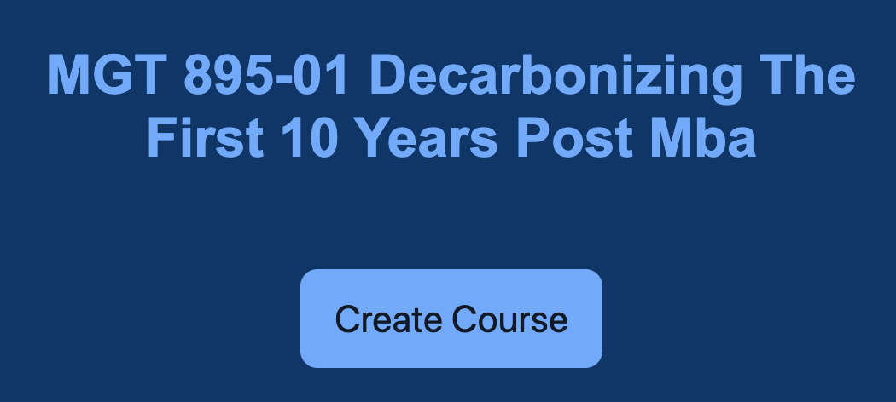

# som-course-generator

A Flask Python app that uses a bigram Markov model to generate new course names based off of the real <a href="https://som.yale.edu/elective-core-courses">Yale SOM course catalog</a>. Hosted on Heroku at https://keep-som-weird.herokuapp.com/.

## how it works

The algorithm is as follows:
1) From the list of historical course names, pick one at random and select its first word.
2) To select the second word, take the initial word, look at all of the words that follow it in the historical course catalog, and pick one at random according to the bigram probability distribution.
3) Repeat Step #2 until you generate the stop token.

## training data

This model was trained on all Yale SOM course names in the Auction History spreadsheet provided by the SOM registrar. The code for cleaning the data, calculating the bigram probability distribution, and exporting the needed datastructures to CSV for the web app is available here: https://github.com/ericknudson/som-course-generator/blob/master/Data%20Preparation%20and%20Modeling.ipynb.

## modeling choices

I found that a unigram model (just picking each successive token according to its probability distribution without regard to context) generated nonsensical names like `MGT 955-01 For New Evolution Fund Strategic`.

The trigram model, on the other hand, was much more likely to recreate existing course names that wouldn't be caught by my de-duper due to slight variations.  The names (like `MGT 896-01 Private Equity Projects & Emerging Markets`) sounded so much like real courses that they weren't funny.

The bigram model seemed to be a good middle ground between weird but intelligible course names, like `MGT 811-01 America's Future Role In The Restaurant Industry` or `MGT 871-01 Innovation In Capital & Wine`

I also did some manual tweaking, such as upweighting the "& Society" bigram probability.
